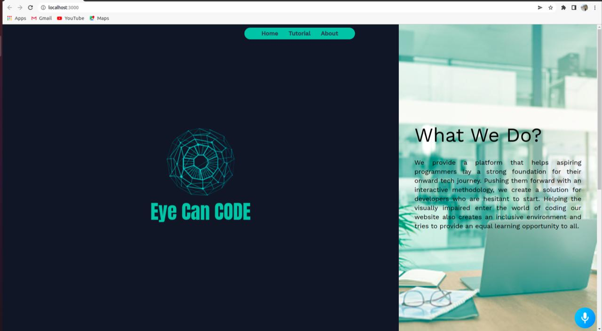
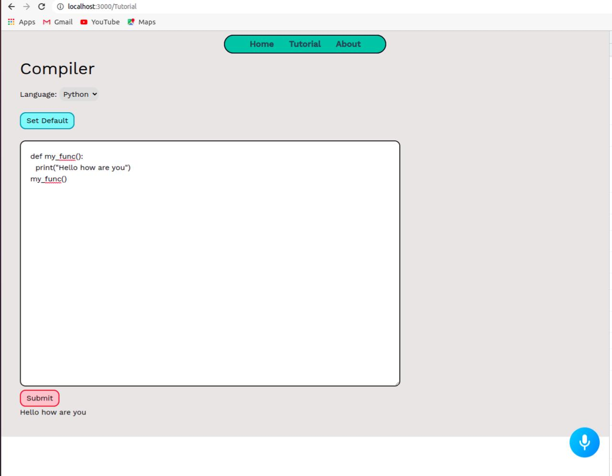
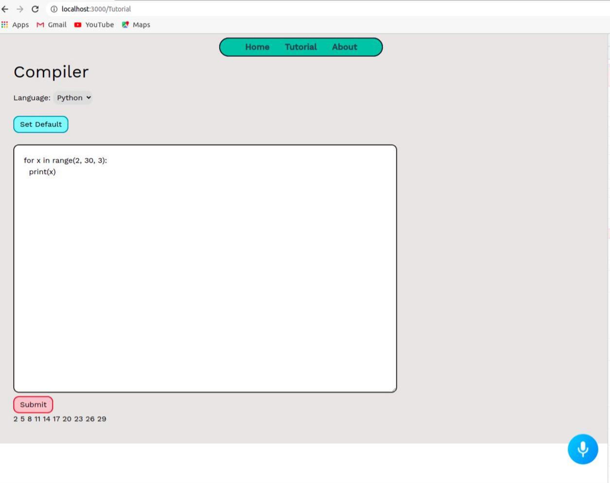
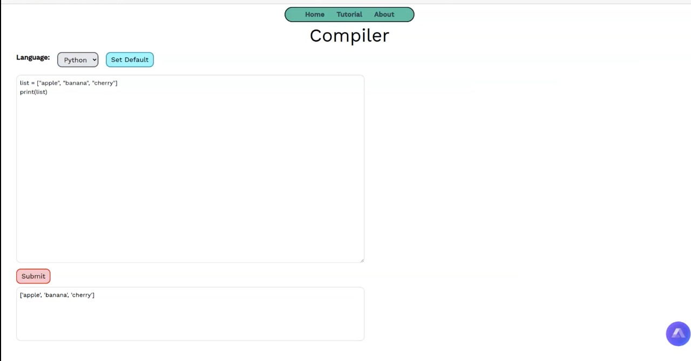
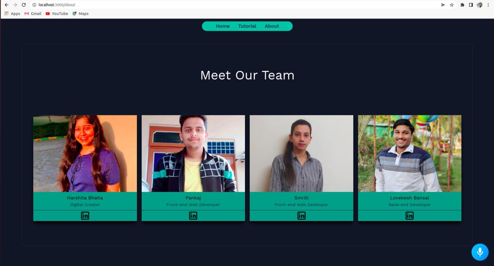

# **EyeCanCode** 
# **Electrothon 4.0** 

##  💼 &nbsp; **Tagline :**  From voice to vision

 🛠 &nbsp;Tech Stack

&nbsp;
&nbsp;

## 🔭 &nbsp; About this Project

>It is estimated that at least 200,000 children in India have severe visual impairment or blindness. During the pandemic, while we are sitting in our homes grasping numerous technological skills along with our daily education, the life of the visually-impaired youth has come to stillness like never before. **Team Dream Makers brings to you “Eye Can Code” a project which will help the visually impaired set forth a step in the colossal coding world.**

>>Bridging the gap between the visually impaired and the technological world, **Eye Can Code** is an initiative that takes the visually impaired on an expedition of programming by transcending voice into vision.
 

<!-- Click on the 
[Link](https://lovekesh-gh.github.io/)
to Visit the Website. -->

## 🔭 &nbsp; Description of the Project

>Our website is built using React, Nodejs and uses Alan AI for voice assistance.Our website has voice navigation between screens helping you explore the complete platform simply through voice commands. The voice assistance also provides you an interactive company with its smart-talking experience.

>**1) Homepage :**  The homepage is designed while keeping **ease of access** as the top priority. The page contains answers to several important questions which make our website easy to navigate and access. 

>**2) Compiler :**  The compiler page of the website has been created while making sure that the general complexities of coding are not too prominent. It also includes voice support at all steps providing constant assistance to make your coding experience smoother.It can perform basic to intermediate task like

**a) Defining a Function :**

**b) For Loop :**

**c) List & Set :**

>**3) About us :**   This page contains information about the team members who have contributed to our project and also puts forward our vision towards the future growth of the website.

<!-- CONTRIBUTING -->

## Contributing

Contributions are what make the open source community such an amazing place to be learn, inspire, and create. Any contributions you make are **greatly appreciated**.

1. Fork the Project
2. Create your Feature Branch (`git checkout -b feature/AmazingFeature`)
3. Commit your Changes (`git commit -m 'Add some AmazingFeature'`)
4. Push to the Branch (`git push origin feature/AmazingFeature`)
5. Open a Pull Request
---
<!-- LICENSE -->
## 

Distributed under the MIT License. See `LICENSE` for more information.

